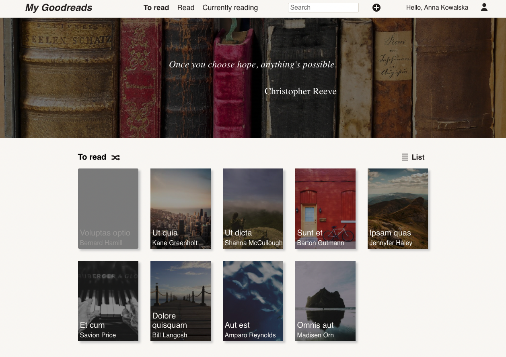
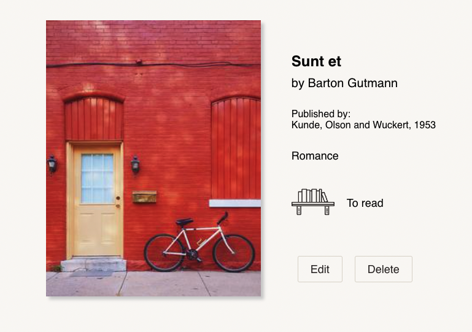

## About The Project

MyGoodreads is application inspired by [Goodreads](https://www.goodreads.com/) website. 

I created it to learn React. Below you can find example screenshots from the current version.

Main page view:


Book Card view:


### Built With

* [React.js](https://reactjs.org/)
* [Styled components](https://styled-components.com/)
* [Mock Service Worker](https://mswjs.io/)
* [React Router](https://reactrouter.com/)
* [React Hook Form](https://react-hook-form.com/)
* [Prop Types](https://github.com/facebook/prop-types)
* [React Modal](https://github.com/reactjs/react-modal)
* [Downshift](https://github.com/downshift-js/downshift)
* [Axios](https://github.com/axios/axios)
* [Cypress](https://www.cypress.io/)

## Getting Started

To run demo version visit: https://mygoodreadsapp.netlify.app/      

To get a local copy up and running follow these steps.

1. Clone the repo
   ```sh
   git clone https://github.com/maciejewskakatarzyna/my_goodreads.git
   ```
2. Install NPM packages
   ```sh
   npm install
   ```
3. Start the project
   ```sh
   npm start
   ```
4. To sign in to application, provide following credentials:

   ```
   Email: kowalska@mygoodreads.com
   ```

   ```
   Password: Test123
   ```
   

## Features

MyGoodreads application has a lot of features to manage your personal books library! Here are the most valuable ones:
* Books listed by shelf: to read, read end currently reading
* Search bar to search the book in database
* New book adding form
* Book card view with book's details
* Delete book
* Edit book
* Change book's shelf
* User authentication and authorization

## Roadmap

MyGoodreads is still being developed. Below you can find the planned features:

- [ ] Unit and integration tests
- [ ] End to end tests
- [ ] Mobile view
- [ ] Pagination
- [ ] Books rating (star system)
- [ ] Similar books recommendations
- [ ] Reading progress
- [ ] Dark mode
- [ ] Draw a random book with parameters
- [ ] User settings
    

